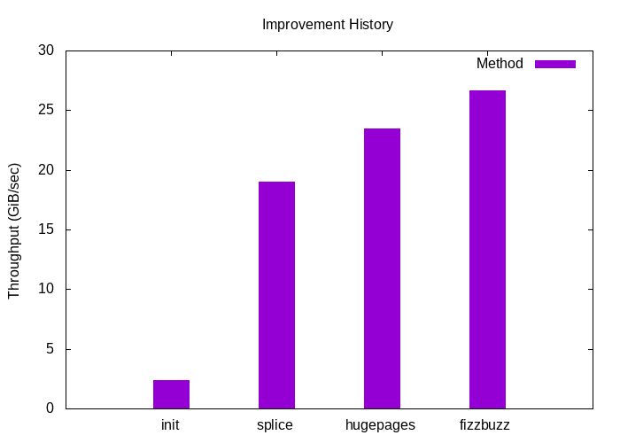

# Fast Pipes
## Motivation
Generally, I wanted to find out more about the Linux Kernel and this was a nice side project.

## Goal
Speed. Speed. Speed.

Seriously, coming as close as possible to the performance of [fizzbuzz](https://codegolf.stackexchange.com/questions/215216/high-throughput-fizz-buzz/236630#236630).
This is a highly optimized assembler version of the fizzbuzz interview question.
It uses VLIWs and specifically the L2 cache buffer size.

## Progress
Checkout the commit history to see the progress.

## Resources
I followed this excellent [blog post](https://mazzo.li/posts/fast-pipes.html).

## Disclaimer
I put the fizzbuzz assembler file in this repo, but I do not claim ownership nor license it.
